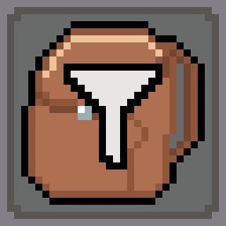

# FiltPick

[](https://www.curseforge.com/minecraft/mc-mods/filtpick)
[](https://modrinth.com/mod/filtpick)

This is a Minecraft mod which enables you to pick up items selectively.
It's a lightweight mod and has a user-friendly interface.

## Introduction

*"Only pick up what you need."*

In vanilla, players automatically pick up any items on the ground if their inventory has enough space. However, there are times when you’d rather avoid picking up certain unwanted items—especially garbage.

This mod solves that problem by allowing you to pick up items selectively. It’s lightweight, intuitive, and features a user-friendly interface. With virtually zero learning curve, it’s ready to use straight out of the box.

## Usage

### Pick modes

You can switch between the two modes.

- Black-list mode: The items in the list won't be picked up.
- White-list mode: **Only** the items in the list will be picked up.

### Destruction modes

You can switch between the two modes.

- Destruction-ON: All the items you can't pick will be destroyed.
- Destruction-OFF: Do nothing.

### Reset filt list

You can reset whole filtlist by one click on the reset button.

## Configurations (1.20.6 and above)

- To adjust the filter list size, modify the `filtpick-server.toml` file in the `/config` directory for **Fabric** and **NeoForge**, or in the `/saves/<your_save_name>/serverconfig` directory for **Forge**. Simply edit the file to increase the filter list size as needed.
- You can adjust the button positions in the `filtpick-client.toml` file located in the `/config` directory.

## Gallery


## Feedback

Feel free to [create an issue](https://github.com/APeng215/FiltPick/issues/new) to report bugs, provide suggestions, or share feedback.

## For developer

Since Minecraft 1.21, this repository now maintains both Fabric and Forge versions of the mod within the same codebase.

If you want to build the source project in a very old version,
remember to delete the proxy settings in file `gradle.properties`.
```
# Used for proxy of the author, delete it if you are not the author.
systemProp.http.proxyHost=127.0.0.1
systemProp.http.proxyPort=10809
systemProp.https.proxyHost=127.0.0.1
systemProp.https.proxyPort=10809
```

## Credits

### Localization

- 日本語 - [Dulroy](https://space.bilibili.com/313723598)

## Release Pages

[CurseForge](https://www.curseforge.com/minecraft/mc-mods/filtpick)
/ [Modrinth](https://modrinth.com/mod/filtpick)
/ [GitHub](https://github.com/APeng215/FiltPick)
/ [MC百科](https://www.mcmod.cn/class/8081.html)

